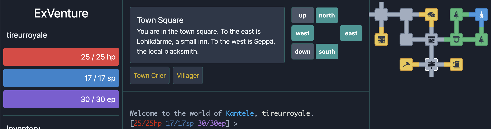

Deploying an MMO Worldwide
==========================

Today we'll be exploring deploying a non-trivial Elixir, Phoenix, and React application to multiple regions, and making some changes across the stack to showcase our efforts!

### ExVenture

The project we will be deploying is [ExVenture](https://exventure.org/readme.html), an open-source text-based MMO inspired by some of the [first online games ever made](https://en.wikipedia.org/wiki/MUD).

ExVenture is a great subject for study, since it's freely available, demonstrates non-trivial usage of different technologies we're interested in, and pre-packaged to be straight-forward to deploy.

### Fly

We'll be deploying to [Fly](https://fly.io), which makes it simple to deploy to multiple regions and transparently access them.

We can also use some clever HTTP headers to force our traffic to particular regions, which will be invaluable during testing!

Getting ExVenture
-----------------

We'll be starting off grabbing a copy of ExVenture to work on. This guide is based off of a particular commit, which we can grab via:

```sh
git clone -b start --depth=1 git@github.com:christhekeele/ex_venture.git
cd ex_venture
```

Initial Deployment
------------------

Deploying ExVenture to Fly is pleasantly straightforward, since it is already dockerized and set up with [mix releases](https://hexdocs.pm/mix/1.11.3/Mix.Tasks.Release.html)!

### Setting up Fly

Provided we've [installed `flyctl`](https://fly.io/docs/getting-started/installing-flyctl/) and [logged in](https://fly.io/docs/getting-started/login-to-fly/) to an account, we can begin by running:

```sh
flyctl init
```

`flyctl` will prompt you for an app name. I'm using `ex-venture` for the purposes of this guide, but you'll want to choose something else, or use an auto-generated one. Take note of it for later.

You'll also be asked what builder and internal port you want to use. We'll select the `Dockerfile` strategy and default Phoenix port of `4000`. Fly will [select a default region](https://github.com/christhekeele/ex_venture/compare/flyctl-init~1...flyctl-init) based on your location (mine was `sea` for Seattle) and generate a [`fly.toml` configuration file for your project](https://github.com/christhekeele/ex_venture/compare/fly-toml~1...fly-toml).

### Configuring the environment

ExVenture uses [Vapor](https://github.com/keathley/vapor), an excellent Elixir configuration library, to make sure you have your runtime environment correctly configured before launching the app. If we tried to `flyctl deploy` right now, we'd [see errors like](https://github.com/christhekeele/ex_venture/compare/unconfigured-deployment~1...unconfigured-deployment):

```
Application ex_venture exited: ExVenture.Application.start(:normal, []) returned an error: shutdown: failed to start child: ExVenture.Repo
ENV vars not set: DATABASE_URL, POOL_SIZE
** (Vapor.LoadError) There were errors loading configuration:
    (vapor 0.10.0) lib/vapor.ex:42: Vapor.load!/1

***v0 failed - Failed due to unhealthy allocations - no stable job version to auto revert to
```

This is Elixir, Vapor, and Fly working well together: our Elixir Application refuses to start (instead of deploying now and failing when an environment variable is needed) because Vapor enforces correct configuration; then Fly tries to roll us back to our last successful deployment (which doesn't yet exist). So, let's get configured correctly!

#### Provisioning a database

We need to give our application a postgres `DATABASE_URL`, so let's provision this quickly on Fly.

First, let's create a database app:

```sh
flyctl postgres create
```

This will ask us for an app name — I chose `ex-venture-db` — and a few other questions related to size and placement. Our local region and a minimal database are sufficient for this exercise.

`flyctl` will [return credentials](https://github.com/christhekeele/ex_venture/compare/flyctl-pg-create~1...flyctl-pg-create) to connect to the database directly. Keep this URL on hand as we'll need it later to migrate our database. Right now though, rather than set this secret value by hand in our application, we can attach this database to our app directly, and Fly will automatically set the `DATABASE_URL` we need. Using the names you chose for your ExVenture app and database app, run:

```sh
flyctl postgres attach --app ex-venture --postgres-app ex-venture-db
```

[We should see](https://github.com/christhekeele/ex_venture/compare/flyctl-pg-attach~1...flyctl-pg-attach) a `DATABASE_URL` secret added to our application successfully.

#### Other configuration

The other environment variable values we need to provide to our application are informally specified in the project's root [`.env` file](https://github.com/christhekeele/ex_venture/blob/start/.env) (and more formally, in the boot-time config file [here](https://github.com/christhekeele/ex_venture/blob/start/lib/ex_venture/config.ex#L36-L37) and [here](https://github.com/christhekeele/ex_venture/blob/start/lib/ex_venture/config.ex#L55-L59)).

We can set most of these env vars [in our `fly.toml`](https://fly.io/docs/reference/configuration/#the-env-variables-section) since they are not strictly secret:

```toml
# fly.toml
# ...
[env]
  HOST = "ex-venture.fly.dev"
  URL_SCHEME = "https"
  URL_PORT = 443
  PORT = 4000
  POOL_SIZE = 3
```

Worth noting that our `HOST` is derived from what we chose to name our Fly app, and that Fly supports https out-of-the-box so we choose `URL` parameters matching that.

Finally, we need to set our `SECRET_KEY_BASE`. This is an arbitrary used to secure other data passing through our application, so we need to handle it carefully: avoiding checking it into our codebases, and if possible encrypting it so that even we can't retrieve it.

Phoenix comes with a command to generate such arbitrary secrets, and `flyctl secrets` lets us store these sorts of secrets securely in our app. I won't be sharing what I used here, but you can see an *example* of generating your own secret key [in the demo application repository](https://github.com/christhekeele/ex_venture/compare/add-secret-key~1...add-secret-key)

We should be ready for our first successful deployment of the ExVenture application! Give it a go and [see what happens](https://github.com/christhekeele/ex_venture/compare/initial-deploy~1...initial-deploy):

```sh
flyctl deploy
flyctl open
```

Interacting with our Release
----------------------------

We've almost running, but if you tried to register an account in our newly deployed app, you likely ran into an `Internal Server Error`. Let's figure out what's up by tailing our logs and submitting that form again:

```sh
flyctl logs
```

We'll see [a pretty bare error log](https://github.com/christhekeele/ex_venture/compare/flyctl-logs-info~1...flyctl-logs-info) indicating we are getting a 500 error back. However, if we deploy again, [temporarily setting our release to use more verbose logging](https://github.com/christhekeele/ex_venture/compare/verbose-logging~1...verbose-logging), the problem becomes immediately apparent:

```
Request: POST /register
Server: ex-venture.fly.dev:80 (http)
19:35:22.097 [error] #PID<0.4770.0> running Web.Endpoint (connection #PID<0.4769.0>, stream id 1) terminated
** (exit) an exception was raised:
    ** (Postgrex.Error) ERROR 42P01 (undefined_table) relation "users" does not exist
    query: INSERT INTO "users" ("email","email_verification_token","password_hash","token","username","inserted_at","updated_at") VALUES ($1,$2,$3,$4,$5,$6,$7) RETURNING "id"
        (ecto_sql 3.5.3) lib/ecto/adapters/sql.ex:751: Ecto.Adapters.SQL.raise_sql_call_error/1
        (ecto 3.5.4) lib/ecto/repo/schema.ex:649: Ecto.Repo.Schema.apply/4
        (ecto 3.5.4) lib/ecto/repo/schema.ex:262: anonymous fn/15 in Ecto.Repo.Schema.do_insert/4
        (ecto 3.5.4) lib/ecto/multi.ex:646: Ecto.Multi.apply_operation/5
        (elixir 1.11.1) lib/enum.ex:2181: Enum."-reduce/3-lists^foldl/2-0-"/3
        (ecto 3.5.4) lib/ecto/multi.ex:630: anonymous fn/5 in Ecto.Multi.apply_operations/5
        (ecto_sql 3.5.3) lib/ecto/adapters/sql.ex:1027: anonymous fn/3 in Ecto.Adapters.SQL.checkout_or_transaction/4
        (db_connection 2.3.0) lib/db_connection.ex:1426: DBConnection.run_transaction/4
```

Our database is provisioned and connected to, but we haven't yet run migrations!

This takes a little extra setup on Fly today: we need to get VPN access to our deployed application's network, for which there is a guide [here](https://fly.io/docs/reference/privatenetwork/#private-network-vpn). This will let us reference our Fly postgres instance by app name + `.internal`, ie `ex-venture-db.internal`.

Then, we can point ecto at our deployed instance by supplying it our production `DATABASE_URL`, and set the database up from our local machine:

```sh
env DATABASE_URL=*** mix do ecto.create, ecto.migrate
```


Now when we visit our application, we should be able to register with ExVenture without issue. We can finally log in, create a player, and see the sample game in action:

> 
>
> Success!
