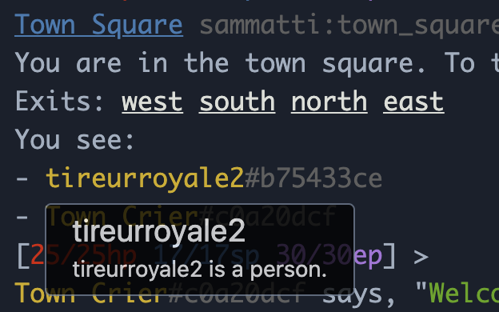
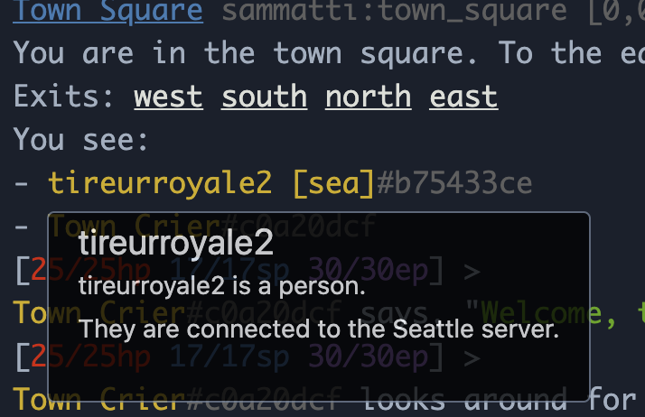

Deploying an MMO Worldwide
==========================

> ***Précis:*** *Add multi-region awareness to an existing Elixir application!*

Abstract
--------

We will be taking an existing Elixir Phoenix project (the open-source textual MMO ExVenture), showing how to deploy it to multiple regions, and then augmenting it so that players can tell which region each other are connected to.

Goals
-----

- Demonstrate deploying a dockerized Elixir project to multiple regions (on fly.io)
- Explain how to instrument an Elixir project with meta-data about what (fly.io) region it is running on
- Show Phoenix developers how to make full-stack changes to implement a feature (multi-region awareness)

Result
------

We will be letting players see which region others are connected to:

> 
>
> Before

> 
>
> After

Outline
-------

1. Forking ExAdventure and deploying to fly.io
  
    *This will end up a lot like the [Run a Ruby App](https://fly.io/docs/getting-started/ruby/) docs for an Elixir Phoenix project, but truncated*

2. Augmenting the Elixir application with information about the `FLY_XXX` environment variables

    *Specificaly, `FLY_REGION`*

3. Adding region metadata to Phoenix users

    *Will do this via db migration and adding to backend user session logic on login*

4. Updating the ExVenture UI to display this information for oneself

5. Updating the ExVenture UI to display this information for others